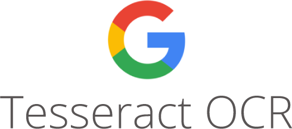

# OCR of documents and invoices Python
 Optical character recognition (OCR) reading amounts and total taxes from invoices and documents, including aligning conversion angles and more

  
  
  
  

  
  
  

